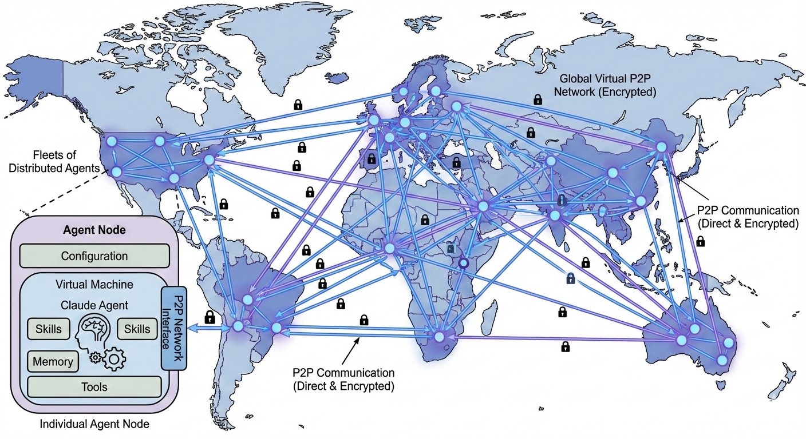

# AXL

Gensyn is building an open, permissionless, P2P network for decentralized agentic and AI/ML applications.  This repository provides a tool to minimize friction when spinning up P2P networks.  It provides a node as an entrypoint into a decentralized P2P network with an api bridge for simple application interface.  The node provides the communication layer for agents and AI applications to exchange data directly with each other, forgoing any centralized services.  

## Overview

This project builds upon the Yggdrasil network stack with gvisor/tcp to provide a standalone network node with a local HTTP API bridge. It allows applications (e.g., serving MoE inference, AI agents, etc.) to send/receive data to/from other nodes without requiring a system-wide TUN interface or root privileges.



**Key features:**
- **No TUN required** — runs entirely in userspace using gVisor's network stack
- **No port forwarding needed** — connects outbound to peers; receives data over the same connection
- **Simple HTTP API** — send/recv binary data, query network topology

## Quick Start
### Requirements
- Linux or macOS. The node runs in userspace and does not need root.
- Go 1.25.5+ installed (the build system pins `GOTOOLCHAIN=go1.25.5` automatically).
- `openssl` if you want a persistent identity; otherwise a fresh one is generated each start.

> **On Windows?** Use WSL2 (Ubuntu 22.04 verified). The prebuilt `node` binary in this repo is a **Linux ELF x86-64** — it won't run from native Windows / PowerShell. Build and run from inside WSL.

```bash
make build
openssl genpkey -algorithm ed25519 -out private.pem # or provide your own key
./node -config node-config.json
```

By default the node binds its HTTP API to `127.0.0.1:9002`. Hit it to confirm it's alive:

```bash
curl -s http://127.0.0.1:9002/topology
```

See [Configuration](docs/configuration.md) for build details, CLI flags, and `node-config.json` options.

### Try it locally: two nodes on one machine

The fastest way to confirm peering and the `/send` ↔ `/recv` round-trip works end-to-end. Run each block in its own terminal.

**Setup** (once):
```bash
mkdir -p n1 n2
cp node n1/ && cp node n2/
openssl genpkey -algorithm ed25519 -out n1/private.pem
openssl genpkey -algorithm ed25519 -out n2/private.pem
```

`n1/node-config.json` — listener:
```json
{
  "PrivateKeyPath": "private.pem",
  "Peers": [],
  "Listen": ["tls://127.0.0.1:9001"],
  "api_port": 9002,
  "tcp_port": 7000
}
```

`n2/node-config.json` — peer:
```json
{
  "PrivateKeyPath": "private.pem",
  "Peers": ["tls://127.0.0.1:9001"],
  "Listen": [],
  "api_port": 9012,
  "tcp_port": 7000
}
```

**Run** — terminal 1:
```bash
cd n1 && ./node -config node-config.json
```
**Run** — terminal 2:
```bash
cd n2 && ./node -config node-config.json
```

You should see `Connected inbound: ...` on n1 and `Connected outbound: ...` on n2. Topology converges within a second or two — both `/topology` responses will list the other node as a peer.

**Smoke-test the API** (terminal 3):
```bash
# Grab each node's pubkey
N1_PK=$(curl -s http://127.0.0.1:9002/topology | jq -r .our_public_key)
N2_PK=$(curl -s http://127.0.0.1:9012/topology | jq -r .our_public_key)

# Send n2 -> n1
curl -i -X POST http://127.0.0.1:9012/send \
  -H "X-Destination-Peer-Id: $N1_PK" \
  --data-binary "hello-from-n2"

# Drain on n1
curl -i http://127.0.0.1:9002/recv     # 200 OK + "hello-from-n2"
curl -i http://127.0.0.1:9002/recv     # 204 No Content
```

### Common gotchas

- **`tcp_port` must match across all peers.** It's a *virtual* port inside each node's gVisor stack (not a host port), so two nodes on the same machine can both use `7000` without conflicting — but a sender always dials the destination at the same number it uses locally. Mismatched values produce `502 Bad Gateway: connection was refused` on `/send`. Keep the default `7000` everywhere unless you have a reason not to.
- **API port stays loopback.** `bridge_addr` defaults to `127.0.0.1`, so the API is only reachable from the same host. The peering port (`Listen`) is the only thing that needs to be exposed publicly.
- **Empty `/recv` returns `204`, not `200` with empty body.** Poll accordingly.

### Public Nodes
At least one public node is required for spinning up fresh networks. A public node must meet two criteria:
1. If behind a firewall, expose a TCP port on the host so it's reachable from other peers.
2. Configure `node-config.json` to listen on that port.

You can also pass `-listen tls://0.0.0.0:9001` on the CLI; it overrides the config value.

#### Example Config
For example, on a LAN in a hub-and-spoke configuration, the listening machine's config:
```json
{
  "PrivateKeyPath": "private.pem",
  "Peers": [],
  "Listen": ["tls://0.0.0.0:9001"]
}
```
And each spoke peers to the hub's IP:
```json
{
  "PrivateKeyPath": "private.pem",
  "Peers": ["tls://192.168.0.22:9001"],
  "Listen": []
}
```

The API port (`9002`) does not need to be exposed — it stays on `127.0.0.1` for local apps to talk to the node.

## Philosophy

Our intent is to provide a simple, permissionless, and secure communication layer for AI/ML workflows.  This node is agnostic to the application layer and simply provides an interface for applications to build upon.  Enforcing the separation of concerns between the network layer and the application layer allows for greater flexibility and scalability.  We are excited to see what you build!

We encourage anyone to run a public node to help bootstrap the network, or just spin up your own P2P network in isolation.

## Documentation

| Document | Contents |
|----------|----------|
| [Architecture](docs/architecture.md) | System diagram, how it works, wire format, submodules |
| [HTTP API](docs/api.md) | All endpoints: `/topology`, `/send`, `/recv`, `/mcp/`, `/a2a/` |
| [Configuration](docs/configuration.md) | Build/run, CLI flags, `node-config.json` |
| [Integrations](docs/integrations.md) | Python services: MCP router, A2A server, test client |
| [Examples](docs/examples.md) | Remote MCP server, adding A2A |

## Citation

If you use AXL in your research or project, please cite it as follows:

**BibTeX:**

```bibtex
@misc{gensyn2026axl,
  title         = {{AXL}: A P2P Network for Decentralized Agentic and {AI/ML} Applications},
  author        = {{Gensyn AI}},
  year          = {2026},
  howpublished  = {\url{[https://github.com/gensyn-ai/axl](https://github.com/gensyn-ai/axl)}},
  note          = {Open-source software}
}
```
